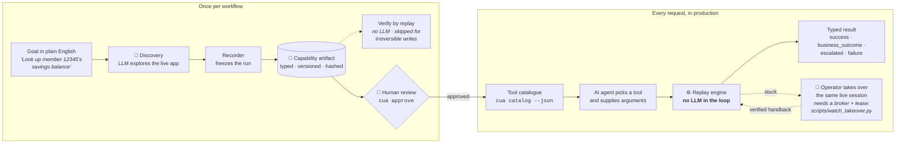
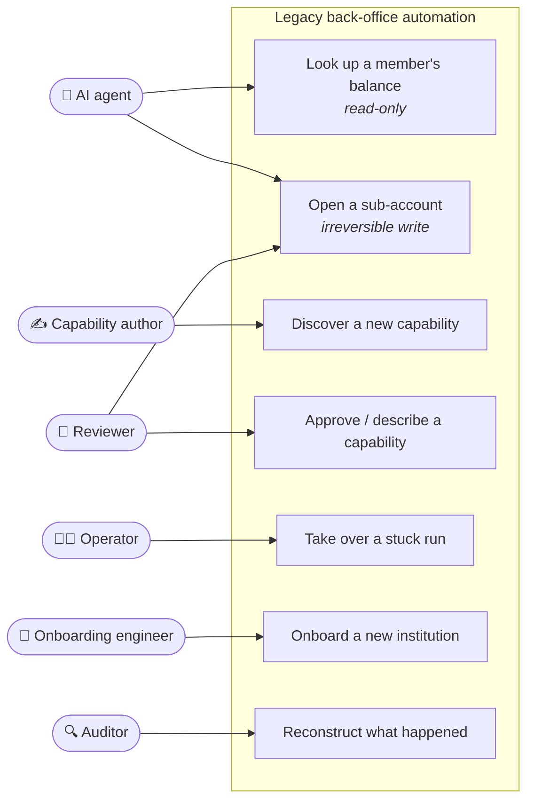
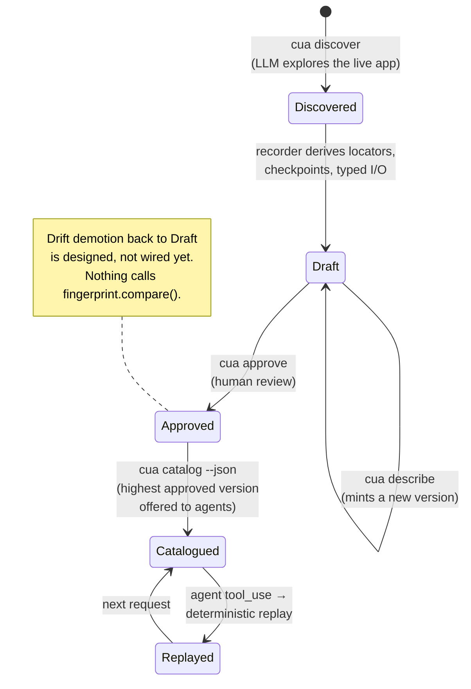
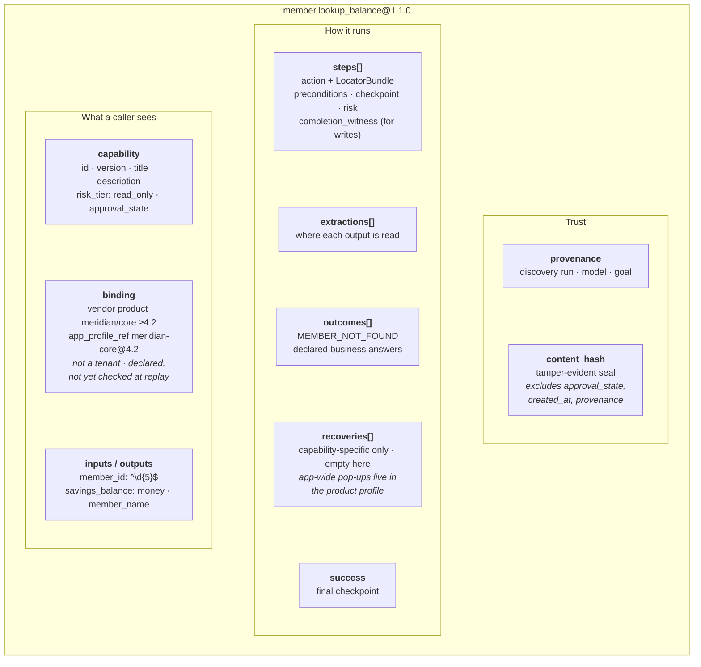
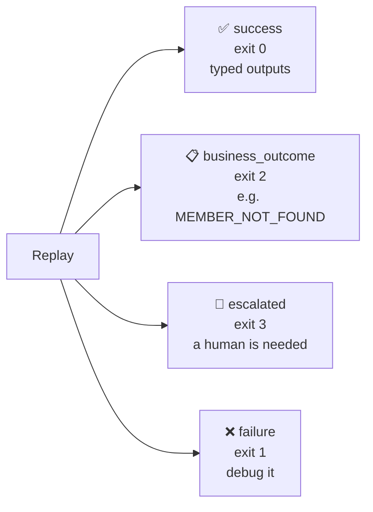
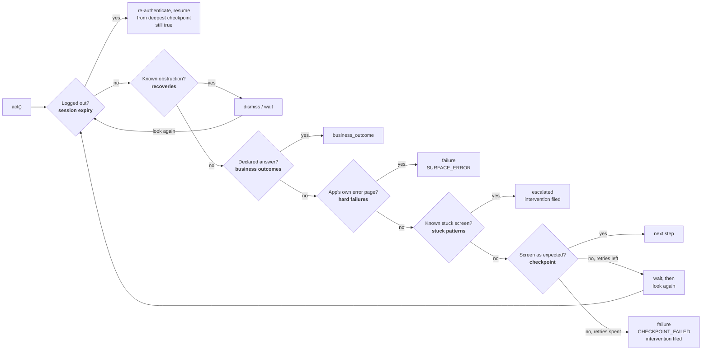
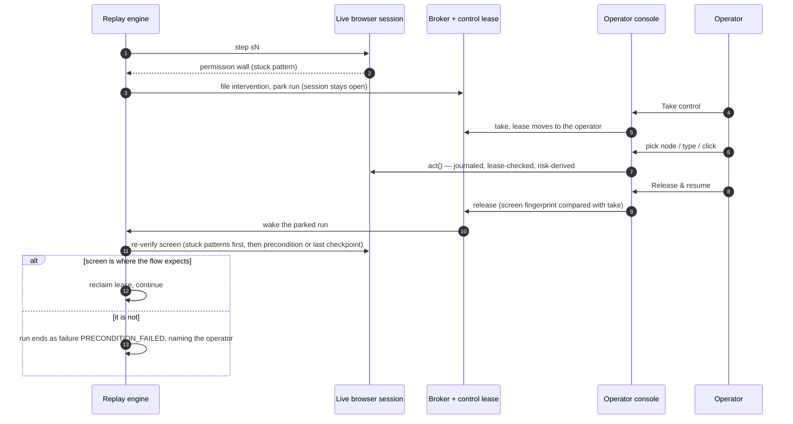
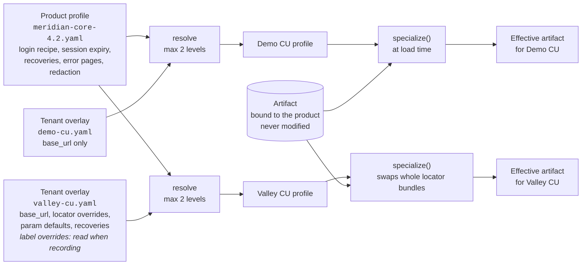
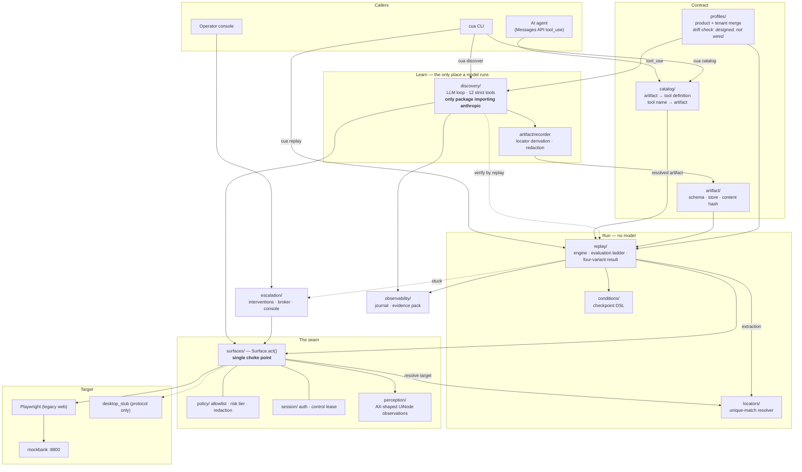

# Computer-use automation for legacy back-office apps

**Teach an AI a bank back-office task once. Run it reliably forever after, with no
AI guessing in production, and a human who can take the wheel when it gets stuck.**

> The model discovers. The artifact becomes a reusable capability. Deterministic
> replay is how an AI agent invokes it in production.

- [The problem](#the-problem)
- [Who it is for](#who-it-is-for)
- [The solution in one picture](#the-solution-in-one-picture)
- [Product use cases](#product-use-cases)
- [How it works](#how-it-works)
- [Architecture](#architecture)
- [Quick start](#quick-start)
- [Demo walkthrough](#demo-walkthrough)
- [Repository map](#repository-map)
- [Further reading](#further-reading)

---

## The problem

Banks and credit unions run their operations on **core and back-office systems
built decades ago**. Looking up a member, opening a sub-account or checking a
balance happens in a web or desktop UI that has **no API**. Staff do it by hand,
screen by screen.

An AI assistant that wants to answer *"What's my savings balance?"* has to get
the answer out of one of those screens. There are two obvious ways to do that, and
neither is good enough for a regulated institution:

| Approach | Why it falls short |
|---|---|
| **Hand-written RPA scripts** | Brittle. Element ids change, labels differ from one institution to the next, and every new customer means writing the script again. |
| **An LLM driving the screen live on every request** | Slow, costly and non-deterministic. You cannot audit why it clicked what it clicked, and it may post a transaction nobody asked for. |

What an institution actually needs:

- **Reliable.** The same inputs follow the same path, and an unexpected result
  comes back as a clear typed answer rather than a crash.
- **Safe.** The system never takes an irreversible action without authorisation,
  and it never leaks account numbers or names into logs, screenshots or prompts.
- **Portable.** One recorded workflow serves every institution running the same
  vendor product, even when each has renamed its labels.
- **Supervised.** When automation gets stuck, a person picks up **the same live
  session** instead of starting over.
- **Auditable.** Afterwards, anyone can reconstruct what happened and why.

## Who it is for

| Persona | What they get |
|---|---|
| **AI agent** (e.g. a member-facing assistant) | A catalogue of typed tools such as `member_lookup_balance(member_id)`, each returning one of four well-defined results. |
| **Capability author** | A goal in plain English turns into a recorded, reviewable workflow. They never write a selector. |
| **Reviewer / risk owner** | A readable artifact to approve before it can run unattended, plus a hard gate on anything irreversible. |
| **Back-office operator** | A console for taking over a stuck run in the same browser session, fixing it, and handing it back. |
| **Onboarding engineer** | A small per-institution overlay file instead of re-recording every workflow. |
| **Auditor / compliance** | An evidence pack for every run: journal, redacted screenshots, typed result. |

## The solution in one picture



The model's job ends once it has explored the task. What it learns is frozen into
a **capability artifact**: a JSON contract with typed inputs and outputs, ordered
steps, robust element locators, checkpoints and declared business outcomes. In
production, a deterministic engine replays that artifact. The model's only
remaining role is **choosing which capability to call**. It is never inside the
capability while it runs, and a test enforces that.

The target app here is **`mockbank`**, a deliberately hostile fixture. It uses a
frameset, element ids that change on every render, three different labelling styles
on one form, eight injectable faults, and two credit unions running the same vendor
product with different labels.

---

## Product use cases



### 1. Answer a member's question: read-only lookup
*"What's the savings balance for member 12345?"* The agent calls
`member_lookup_balance` and gets `{"savings_balance": "4210.75"}` back from a
deterministic replay. Member 99999 does not exist, so that call returns a **business
outcome** (`MEMBER_NOT_FOUND`) and not an error, because "no such member" is a
legitimate answer.

### 2. Perform a write safely: open a sub-account
`member.open_subaccount` is `writes_irreversible`. It runs only when **both** of
these hold: a human has **approved** the artifact, and the caller explicitly passes
**`confirm_irreversible`**. If either is missing, the run is refused with
`IRREVERSIBLE_NOT_AUTHORIZED`. If a session drops mid-write, the engine will not
blindly repeat the step. It checks whether the write landed, or escalates.

### 3. Onboard a new institution without re-recording
Valley Credit Union runs the same core product as Demo CU but renamed the nav item
and the member-id field, and shows a different consent modal. A small tenant
overlay (`profiles/tenants/valley-cu.yaml`) supplies two locator replacements, and
the recording made against Demo CU replays on Valley CU unchanged.

### 4. Hand a stuck run to a human, then take it back
The run hits a permission wall mid-flow. It does not exit: it **parks**, files an
intervention, and serves the live session in an operator console. The operator
takes control, fixes the problem and releases. Before continuing, the engine
**re-verifies the screen** and refuses loudly if the screen is not where the flow
expects.

### 5. Discover a brand-new capability
An author runs `cua discover --goal "..."`. An LLM explores the live app by picking
numbered on-screen elements. It never writes selectors. The recorder turns the
successful path into an artifact, with every step traced back to the model's stated
reason.

### 6. Audit any run after the fact
Every run leaves `evidence/runs/<id>/` behind, holding the decision journal, the
typed result, per-step accessibility snapshots, and masked screenshots of the
failing step. Account numbers and names are redacted before anything reaches disk.

---

## How it works

### The capability lifecycle



Only **approved** capabilities appear in the catalogue. A tool definition is an
offer, and offering an unreviewed capability to a model means unreviewed
automation runs against a bank's systems.

### What an artifact contains



A **LocatorBundle** is a ladder of fallback strategies: role and name, label,
position relative to an anchor ("the *Balance* cell of the *Savings* row"), then
pattern. Each rung records why it was chosen and how stable it is. A locator must
match **exactly one** element. If it matches several, the run escalates. It never
falls back to "first match wins".

### Four results, never collapsed



"That member does not exist" is **not** a failure. Merging these four into
"worked / didn't" is the most common mistake in automation of this kind, so they
stay distinct all the way through: in the CLI exit code, in `result.json`, and in
the `tool_result` a model reads.

### The evaluation ladder: what the engine checks after every action



The order matters. A marketing pop-up is not a failed checkpoint, and "already
exists" is the institution answering, not the automation breaking.

### Human takeover of the same live session



The **control lease** is enforced inside `act()`. Whoever does not hold it cannot
act on the session. The lease has five states: `AUTOMATION_OWNED`,
`PAUSED_PENDING_HUMAN`, `HUMAN_OWNED`, `RESUMING` and `ABANDONED`.

### Multi-tenant: one recording, many institutions



Overlays go at most two levels deep (product, then tenant). Each resolution is
written to the journal, so any specialisation can be traced.

---

## Architecture



**Four ideas carry the design:**

1. **One seam: `Surface`.** Perceiving and acting sit behind a protocol. Nothing
   above it knows what Playwright is. Observations are *accessibility-shaped*
   (role, name, value, anchors), not DOM-shaped, so a desktop app would need a new
   adapter and nothing else.
2. **One contract: the capability artifact.** It serves three audiences at once:
   the calling agent (typed I/O), the reviewer (can this run unattended?), and the
   engine (execute with no model).
3. **One choke point: `Surface.act()`.** The allowlist, the risk tier (derived
   from the element that *actually* matched) and the control lease are enforced
   here, in code. None of them is a prompt instruction.
4. **One result union.** `success | business_outcome | escalated | failure`.

### Design guarantees

| Guarantee | How it is enforced |
|---|---|
| No LLM in the production decision loop | An import-graph test proves `replay/` never reaches `anthropic` |
| The model never writes a selector | It picks numbered nodes. The recorder derives the locators |
| No ambiguous clicks | Locators resolve only on a unique match. Anything else escalates |
| No surprise writes | Irreversible needs `approved` **and** `confirm_irreversible`. A resume never repeats an irreversible step |
| No leaked PII or secrets | Profile-declared sensitive regions and regex detectors mask values at every egress. Profiles hold `env:` references, never credentials |
| No unsupervised human edits | Operator actions go through `act()`. Direct clicks in the browser window are detected and flagged as an *unsanctioned change* |
| Full traceability | Every decision is journaled, including the invalid ones |

---

## Quick start

```bash
uv sync                              # install
uv run playwright install chromium
cp .env.example .env                 # fixture credentials (fake) + optional API key
uv run pytest                        # 459 tests, no API key needed
uv run cua serve-app                 # mockbank on :8800 — leave it running
```

In another terminal:

```bash
uv run cua replay member.lookup_balance --params '{"member_id":"12345"}'
```

`.env` is gitignored. Only `cua discover` and `scripts/watch_agent_call.py` need
`ANTHROPIC_API_KEY`. **Everything else runs offline.**

### CLI at a glance

| Command | What it does |
|---|---|
| `cua serve-app` | Start the `mockbank` target on :8800 |
| `cua dry-run` | Exercise the discovery loop's control logic against scripted screens. 0 API calls |
| `cua discover` | Real LLM discovery run → new draft artifact + evidence |
| `cua describe` | Author the caller-facing description (mints a new version) |
| `cua approve` | The human review gate |
| `cua catalog` | List invocable capabilities. `--json` emits the Messages API `tools` payload |
| `cua replay` | Deterministic replay. Exit code = result variant |
| `cua inject` | Arm a fault in the fixture |
| `cua serve-console` | Read-only operator console over `evidence/` |

---

## Demo walkthrough

The commands follow the story, in order. Start `uv run cua serve-app` first.

### 1. What a calling agent sees

```bash
uv run cua catalog               # on a fresh clone this lists NOTHING. That is the point.
uv run cua catalog --include-drafts
uv run cua catalog --json        # the Messages API `tools` payload
```

Each tool definition carries typed inputs, typed outputs and declared business
outcomes. It is generated from the artifact, never written by hand, and no model is
involved at call time.

**Only `approved` capabilities are listed.** Both committed artifacts ship as
drafts, so the default catalogue is empty and says so. `--include-drafts` shows
them, marked, for review. A draft never reaches the `--json` payload. `cua approve`
is the gate. The catalogue offers **one version per capability**, the highest
approved one. `cua replay id@version` still addresses any version directly.

```bash
uv run cua describe member.lookup_balance --description "..."   # mints a new version
```

The description is what a production model reads when deciding whether to call a
capability. The recorder therefore refuses to write it: it knows what was asked of
the *explorer*, not what the capability is *for*. `cua approve` refuses a
capability described by its own discovery goal. See §7 of `REPORT.md` for the run
where a model followed such a goal into a wasted replay.

### 2. A real model calling a capability

```bash
uv run python scripts/watch_agent_call.py              # needs ANTHROPIC_API_KEY
uv run python scripts/watch_agent_call.py --bad-argument
uv run python scripts/watch_agent_call.py --headed
```

This is the whole last mile, and nothing is staged. `cua catalog --json` is shelled
out for real and sent as `tools` to Sonnet with *"What's the savings balance for
member 12345?"*. The model's `tool_use` is resolved back to its artifact and handed
to the same replay engine everything else uses. The result returns as a
`tool_result`, and the model answers from it. It takes two model calls and costs
about a cent. The script also re-walks the replay path's import graph with
`anthropic` loaded in the same process, which shows that a model choosing the
capability does not put a model inside it.

### 3. Deterministic replay and the four result variants

Exit codes: `0` success · `1` failure · `2` business outcome · `3` escalated.

```bash
# success
uv run cua replay member.lookup_balance --params '{"member_id":"12345"}'

# business outcome — NOT a failure. "No such member" is the answer you asked for.
uv run cua replay member.lookup_balance --params '{"member_id":"99999"}'

# a genuine application error, mid-flow
uv run cua replay member.lookup_balance --params '{"member_id":"12345"}' \
    --inject error_500 --arm-at-step s3

# a state no capability anticipated -> a human is needed
uv run cua replay member.lookup_balance --params '{"member_id":"12345"}' \
    --inject permission_denied --arm-at-step s3

# silently recovered: the session drops mid-flow, the engine re-authenticates,
# rewinds to the last checkpoint that is still true, and finishes
uv run cua replay member.lookup_balance --params '{"member_id":"12345"}' \
    --inject session_timeout --arm-at-step s3
```

Every run writes `evidence/runs/<run_id>/`. The eight injectable faults are
`not_found`, `validation_error`, `permission_denied`, `interstitial`,
`session_timeout`, `slow_load`, `error_500` and `duplicate`.

### 4. The same recording on a different institution

```bash
uv run cua replay member.lookup_balance --params '{"member_id":"12345"}' --tenant valley-cu
```

The artifact was recorded against `demo-cu` and is not re-recorded. The run prints
which tenant overrides it applied.

### 5. Safety: an irreversible capability will not just run

```bash
# refused twice over: the artifact is a draft, and nobody asked for the write
uv run cua replay member.open_subaccount \
    --params '{"member_id":"12345","product_code":"HSA","initial_deposit":"50.00"}'

uv run cua approve member.open_subaccount --reason "reviewed the recorded flow"

# still refused — approval is only half of it
uv run cua replay member.open_subaccount \
    --params '{"member_id":"12345","product_code":"HSA","initial_deposit":"50.00"}'

# runs
uv run cua replay member.open_subaccount \
    --params '{"member_id":"12345","product_code":"HSA","initial_deposit":"50.00"}' \
    --confirm-irreversible

# this one really did write. Put the fixture back, so step 3 still works afterwards.
curl -X POST localhost:8800/t/demo-cu/__control/reset
```

The reset matters. The write adds a *Savings* row to member 12345, so re-running
step 3 against the changed fixture finds two Savings rows. The engine correctly
refuses to guess between them (`EXTRACTION_FAILED`), which is confusing to see
halfway through the demo. Restarting `cua serve-app` also resets it.

### 6. Human takeover of the same live session

```bash
uv run python scripts/watch_takeover.py
```

A headed browser opens. The run hits a real permission wall mid-flow and
**parks**. It does not exit. Open the console at <http://localhost:8801>, then:

1. open the intervention and press **Take control** (the lease moves to you);
2. drive the session from the console's node list. Clicks go through the same
   `act()` the engine uses, so they are journaled, lease-checked and risk-derived;
3. press **Release & resume**. The engine re-verifies the screen before taking
   the wheel back.

> You can also click directly in the browser window. It is the same session and
> the changes are real, but those actions are **not journaled, not risk-checked,
> and cannot be promoted into the artifact**. The release is recorded as an
> unsanctioned change.

`--fault none` parks on something else. `--headless --wait 6` is a smoke check.
`uv run cua serve-console` serves the same console read-only over `evidence/`.
Takeover is not available there, because takeover needs the browser that is still
open, and that browser lives in the run's own process.

### 7. The real discovery run (needs an API key)

```bash
uv run cua dry-run               # exercises the loop's control logic. 0 API calls.

uv run cua discover --goal "Look up member 12345 and read their current savings balance" \
                    --capability-id member.lookup_balance
```

`discover` runs `dry-run` first and exits `4` rather than spend a real run on a
broken loop. Add `--allow-irreversible` to discover a write flow. `CUA_MODEL` /
`--model` picks the discovery model (default `claude-opus-5`).
`CUA_REVIEWER_MODEL` / `--reviewer-model` picks the authoring reviewer (default
Haiku 4.5). Each run prints measured tokens and an estimated cost for each model.

### Visual inspection

```bash
uv run python scripts/watch_replay.py --tenant valley-cu        # merge + cross-tenant, headed
uv run python scripts/watch_replay.py --inject session_timeout  # recovery path
uv run python scripts/watch_takeover.py --headless --wait 6     # takeover smoke check
```

---

## Repository map

```
mockbank/            the target app — a FIXTURE, not part of the system under test
src/cua/
  surfaces/          the seam: perceive and act, Playwright behind a protocol
  perception/        injected extractor -> UiNode / Observation
  locators/          LocatorBundle: a candidate ladder, unique match or escalate
  artifact/          the capability contract, its store, and the recorder
  profiles/          product profile + tenant overlay, merge, fingerprint/drift
  conditions/        the condition DSL — checkpoints as data, not callbacks
  catalog/           artifact -> tool definition, tool call -> replay
  replay/            the engine, the evaluation ladder, the four-variant result
  discovery/         the LLM loop (the only thing that imports anthropic)
  policy/            allowlist, risk tiers, redaction
  session/           auth + the control lease
  escalation/        intervention store, broker, operator console
  observability/     journal, evidence pack, screenshot annotation
  cli.py             the `cua` command
config/policy.yaml   the allowlist, enforced inside act()
profiles/            product profile + two tenant overlays
capabilities/        recorded artifacts (1.0.0 as recorded, 1.1.0 with authored descriptions)
evidence/            discovery runs, replay runs for every variant, agent round trip
scripts/             headed demos: replay, takeover, agent call
tests/               459 tests, all offline
```

### What is in `evidence/`

| Evidence | Shows |
|---|---|
| `disc_cccbcae3f06c` | Real Opus discovery run that produced the shipped `member.lookup_balance` |
| `disc_e199911014d8` | Real Opus discovery run that produced the shipped `member.open_subaccount` |
| `run_82617c55b4bb` | `success` |
| `run_68b670b3c48a` | `business_outcome` `MEMBER_NOT_FOUND` |
| `run_482df3966f5c` | `failure` `SURFACE_ERROR` (app 500 mid-flow) |
| `run_d2c1d434f225` | `escalated` `PERMISSION_REQUIRED` |
| `run_4dc66cf83e8c` | Session dropped, re-authenticated, rewound and finished: `s1 s2 s3 s1 s2 s3 s4` |
| `run_35f71d735c9a` | Cross-tenant replay on `valley-cu` |
| `run_92e276942bdc` / `run_7a30a00f0a27` | Irreversible write refused, then allowed |
| `agent_round_trip.txt` | A real model calling a capability through the catalogue |

`evidence/README.md` explains how to read each run.

## Further reading

Four files carry the argument. Read them in this order:

1. **[src/cua/surfaces/base.py](src/cua/surfaces/base.py)** — the seam, and why
   `act()` is the only place policy can live.
2. **[src/cua/artifact/schema.py](src/cua/artifact/schema.py)** — the contract
   between the model, the reviewer and the engine.
3. **[src/cua/replay/engine.py](src/cua/replay/engine.py)** — the evaluation
   ladder and the four variants.
4. **[src/cua/session/control.py](src/cua/session/control.py)** — the lease,
   including an honest note on what it does not defend against.

**[REPORT.md](REPORT.md)** is the full design write-up: architecture, artifact
schema, determinism and error handling, heterogeneity and multi-tenant, escalation
and handoff, safety, and what was deliberately cut and why.
